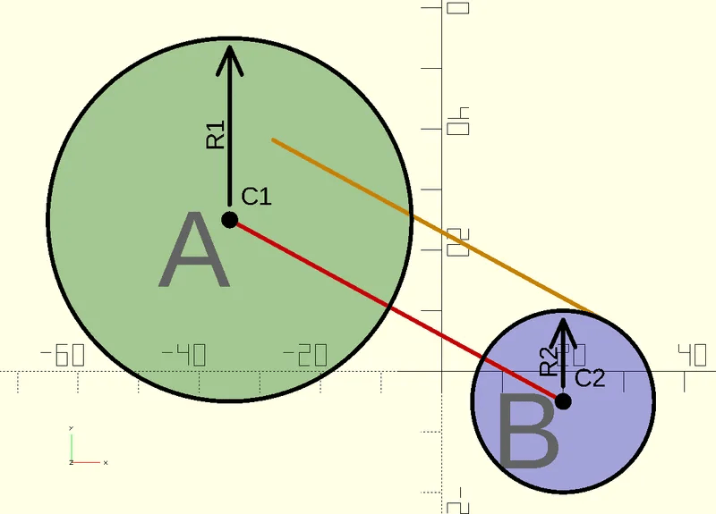
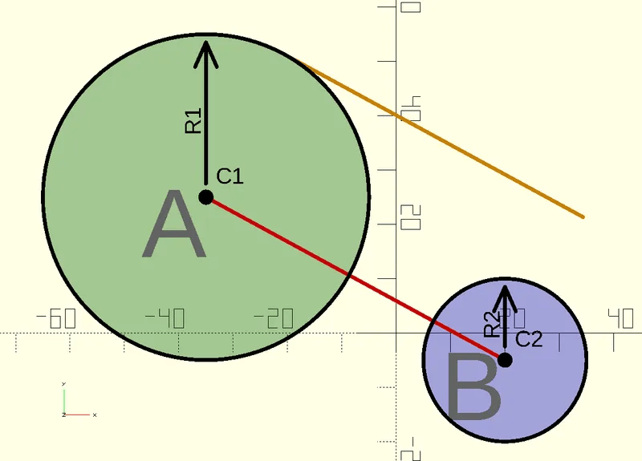
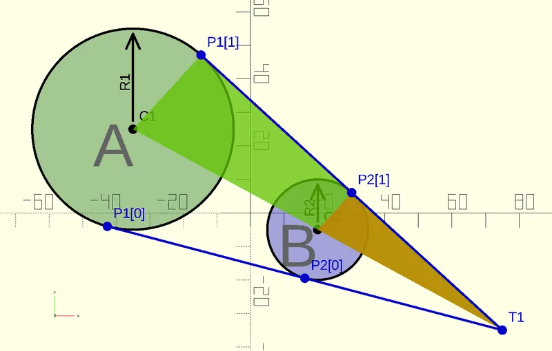
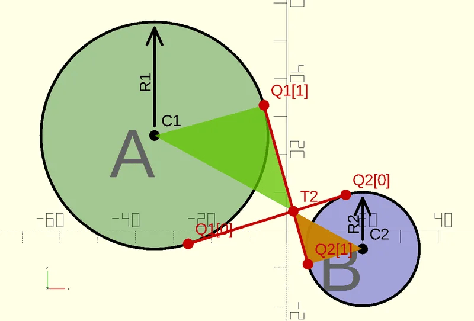
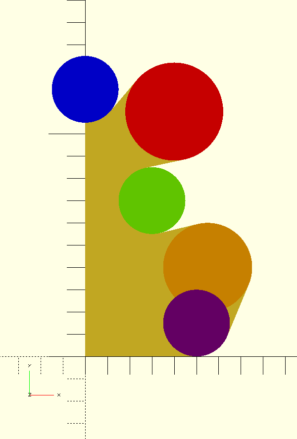
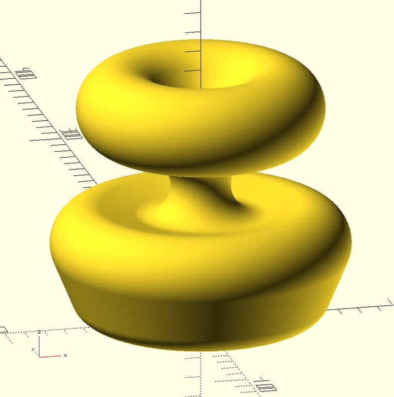
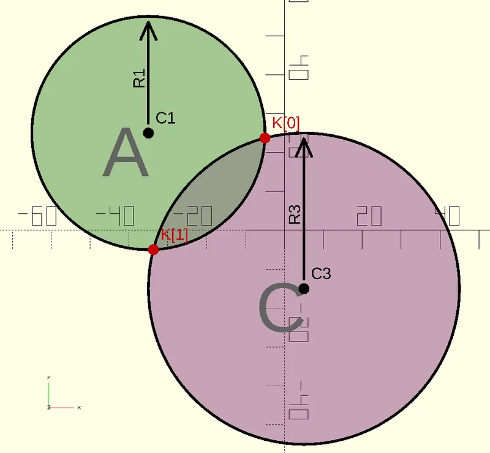
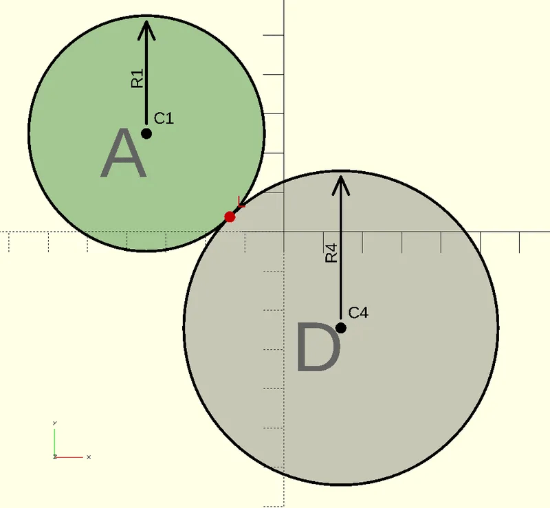
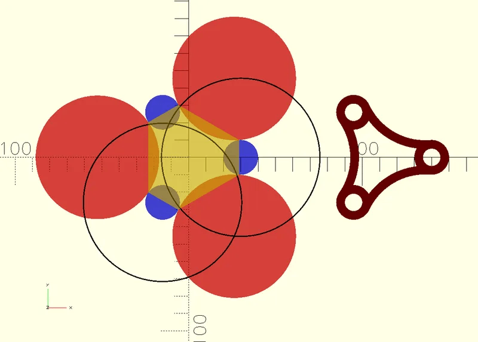

# tangent-lines

Math behind calculating tangent lines on a circle done in OpenSCAD

## Introduction

A file “tangent_lines.scad” is provided with functions to calculate the tangent points on a circle in OpenSCAD. This tutorial might be helpful understand the principle of the tangent points of a circle. The license is CC0 (Public Domain), you may use it in every way that you want.

OpenSCAD is free software: https://openscad.org/

Every picture of this tutorial is made with a OpenSCAD script “tangent_lines_tutorial.scad”. That script is also added.

## Rule number one: Don't use tangent lines in OpenSCAD

If possible, try to avoid tangent lines. If you only want round corners, then there are easier ways. OpenSCAD can make round corners (both inside corners and outside corners) in 2D with the offset() function. There are also Public Domain splines for round shapes. Such as the Public Domain OpenScad Bezier Function by William A. Adams. Those are easier to use in my opinion.

Only when it is necessary that a mechanical part requires a shape with circles and tangent line, then they can be used.

## Classic calcuation

The classic way to calculate the tangent points on a circle is with with a parallel line. The line is parallel to a line between the centers of two circles.
The line is inside the larger circle for external tangent points.



The line is outside the smaller circle for internal tangent points, as seen in the picture below:



There are similar angles and distances and they can be used to calculate the tangent points.

## With the Common Tangent Point and Triangles

To understand the tangent points, I thought it was easier to calculate the common points first. Both the external tangents points and internal tangent points for two circles share a common point.

To calculate the common point, Reddit user ImpatientProf showed a smart way by looking at similar triangles (Reference: [reddit.com/r/openscad/comments/1fqa33m/i_spent_a_few_days_in_tangent_lines/](https://www.reddit.com/r/openscad/comments/1fqa33m/i_spent_a_few_days_in_tangent_lines/))

Suppose there are two circles called “A” and “B”. The center of “A” is “C1” and the radius of “A” is R1.

In OpenSCAD, both circles can be drawn like this:

```javascript
C1 = [-35, 25];
R1 = 30;
translate(C1);
circle(R1);

C2 = [20, -5];
R2 = 15;
translate(C2);
circle(R2);
```

When the common point is used (called “T1” in the picture below), then there are similar triangles. The size of the triangles is relative to the radius of the circle.

Because OpenSCAD can do calculations with vectors, the calculation of “T1” is very simple in OpenSCAD:

```javascript
// The triangles are similar:
// (C1-T1)/R1 = (C2-T1)/R2
// T1 can be calculated from that:
T1 = (R2 * C1 - R1 * C2) / (R2 - R1);
```

When “T1” is known, then the angles for the tangent points have still be calculated in a similar way as the classic calculation.



The disadvantage of calculating T1 first, is when both circles have the same radius. Then T1 can not be calculated.

For the internal tangens lines, the common tangent point is between the circles. There are also similar triangles there.



The calculation of T2 is only slightly different:

```javascript
T2 = (R2 * C1 + R1 * C2) / (R2 + R1);
```

## Example Tangent Lines

This is an example with internal tangent lines and external tangent lines. When all the coordinates of all the tangent points are known, then a polygon can be used to fill a shape.



Since the polygon draws straight lines between the points, the circles of the inner corners have to be removed and the circles for the outer corners have to be added.

The shape in 2D can be rotated into a 3D shape.



## Intersection points

An extra function is added to calculate the intersection points:



## Touch point

A small function to calculate the touch point is added as well.



## Example Intersection and Touch points of circles

The picture below shows the use of intersection points and touch points between circles.

Suppose that the position and size of the blue circles is known. Then the shape on the right can be calculated, depending on the size of the red circles.



First the center points of the red circles are calculated. The black circle edge has a radius of the blue and red circle added together. They cross each other in the center of the lower-right red circle. Then all the positions and size of the blue and red circles are known.

After calculating all the six touch points, a polygon can be drawn between those points. The yellow part is the polygon. By adding the blue circles and removing the red circles, the final shape can be calculated.

## Functions

The functions in the file “Tangent Lines” are:

- PointForInternal(Centre1, Radius1, Centre2, Radius2)
- PointForExternal(Centre1, Radius1, Centre2, Radius2)
- TangentPoints(Centre, Radius, Point)
- IntersectionPoints(Center1, Radius1, Center2, Radius2)
- TouchPoint(Center1, Radius1, Center2, Radius2)

The common tangent point is first calculated. That point is used for the function “TangentPoints”.

## Attribution

This is an expansion and continuation of [this tutorial](https://www.printables.com/model/1030379-tutorial-tangent-lines-of-circles-in-openscad) by [Stone Age Sculptor](https://www.printables.com/@Stone_Age_Sculptor) which was released as CC0 public domain.

```

```
